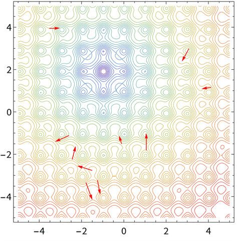
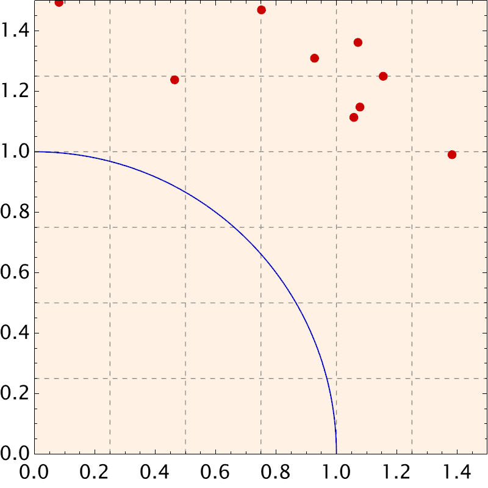
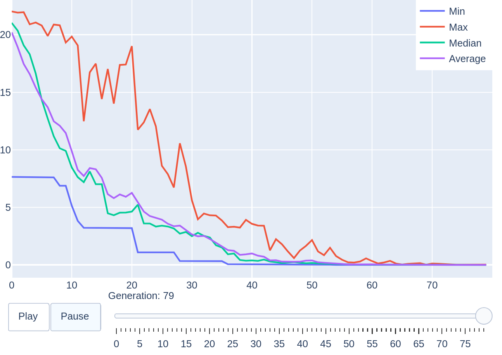
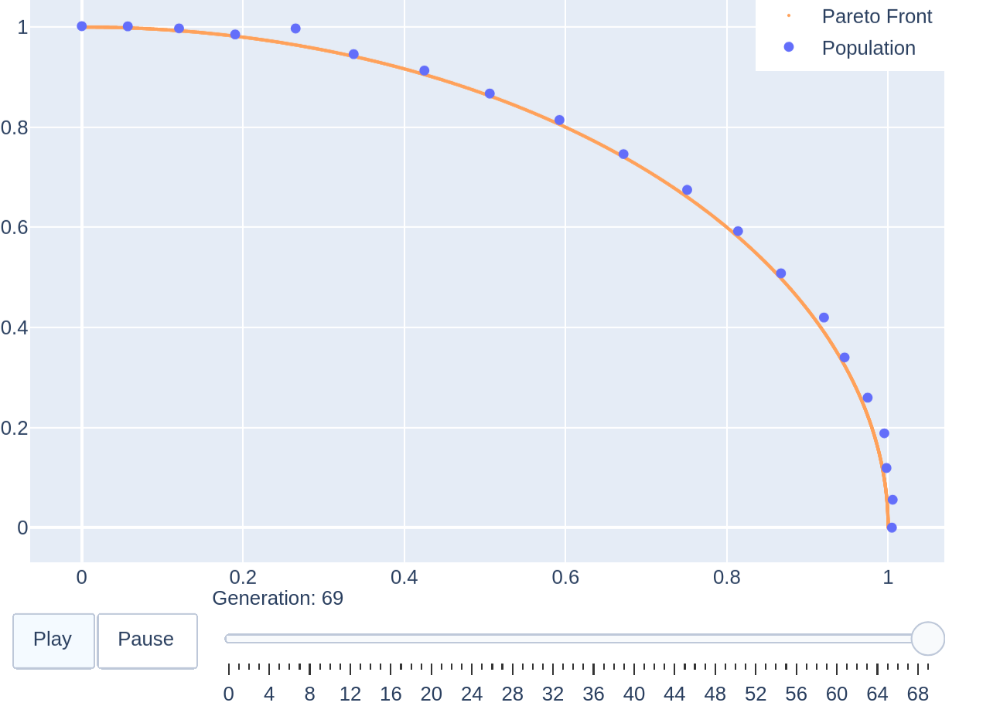
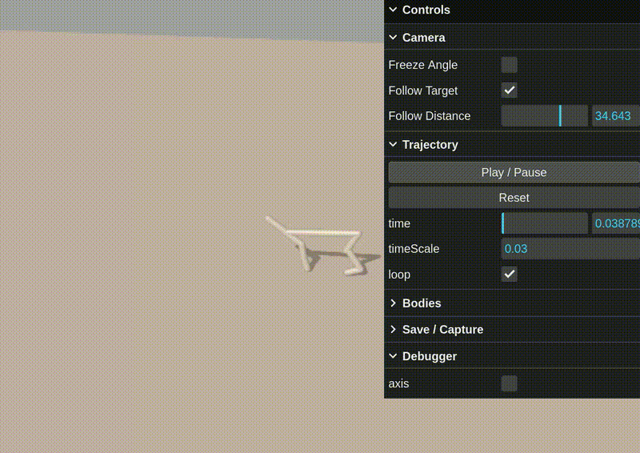

<h1 align="center">
  <picture>
    <source media="(prefers-color-scheme: dark)" srcset="docs/source/_static/evox_logo_dark.png">
    <source media="(prefers-color-scheme: light)" srcset="docs/source/_static/evox_logo_light.png">
    
  </picture>
</h1>

<p align="center">
  <picture>
    <source type="image/avif" srcset="docs/source/_static/pso_result.avif">
    
  </picture>
  &nbsp;&nbsp;&nbsp;&nbsp;
  <picture>
    <source type="image/avif" srcset="docs/source/_static/rvea_result.avif">
    
  </picture>
  &nbsp;&nbsp;&nbsp;&nbsp;
  <picture>
    <source type="image/avif" srcset="docs/source/_static/halfcheetah_200.avif">
    
  </picture>
</p>


<div align="center">
  <a href="https://arxiv.org/abs/2301.12457"></a>
  <a href="https://evox.readthedocs.io/"></a>
  <a href="https://pypi.org/project/evox/"></a>
  <a href="https://pypi.org/project/evox/"></a>
  <a href="https://discord.gg/Vbtgcpy7G4"></a>
  <a href="https://qm.qq.com/q/vTPvoMUGAw"></a>
</div>

<p align="center">
  <a href="./README.md"></a>
  <a href="./README_ZH.md"></a>
</p>

---

<h3 align="center"> 🌟Distributed GPU-accelerated Framework for Scalable Evolutionary Computation🌟 </h3>

---


## 🔥 News
- [2025-03-31] Released **EvoX 1.1.2** - a minor release with bug fixes. [[Details](https://evox.group/index.php?m=home&c=View&a=index&aid=151)]
- [2025-02-03] Released **EvoRL**: A GPU-accelerated framework for **Evolutionary Reinforcement Learning**, powered by **JAX** ! [[Paper](https://arxiv.org/abs/2501.15129)] [[Code](https://github.com/EMI-Group/evorl)]
- [2025-01-30] Released **EvoGP**: A GPU-accelerated framework for **Genetic Programming**, powered by **PyTorch** & **CUDA**! [[Paper](http://arxiv.org/abs/2501.17168)] [[Code](https://github.com/EMI-Group/evogp)]
- [2025-01-14] Released **EvoX 1.0.0** - now fully compatible with **PyTorch**, with full `torch.compile` support! Users of the previous **JAX-based version** can access it on the **v0.9.0 branch**.

## Table of Contents

1. [Overview](#Overview)
2. [Key Features](#key-features)
3. [Main Contents](#main-contents)
4. [Installation Guide](#installation-guide)
5. [Quick Start](#quick-start)
6. [Sister Projects](#sister-projects)
7. [Community & Support](#community--support)

## Overview

EvoX is a distributed GPU-accelerated evolutionary computation framework compatible with **PyTorch**.  With a user-friendly programming model, it offers a comprehensive suite of **50+ Evolutionary Algorithms (EAs)** and a wide range of **100+ Benchmark Problems/Environments**. For more details, please refer to our [Paper](https://arxiv.org/abs/2301.12457) and [Documentation](https://evox.readthedocs.io/en/latest/) / [文档](https://evox.readthedocs.io/zh/latest/).

> [!NOTE]
> Users of the previous **JAX-based version** can access it on the **v0.9.0 branch**.


## Key Features

### 💻 High-Performance Computing

#### 🚀 Ultra Performance
- Supports acceleration on heterogeneous hardware, including both **CPUs** and **GPUs**, achieving over **100x speedups**.
- Integrates **distributed workflows** that scale seamlessly across multiple nodes or devices.

#### 🌐 All-in-One Solution
- Includes **50+ algorithms** for a wide range of use cases, fully supporting **single- and multi-objective optimization**.
- Provides a **hierarchical architecture** for complex tasks such as **meta learning**, **hyperparameter optimization**, and **neuroevolution**.

#### 🛠️ Easy-to-Use Design
- Fully compatible with **PyTorch** and its ecosystem, simplifying algorithmic development with a **tailored programming model**.
- Ensures effortless setup with **one-click installation** for Windows users.


### 📊 Versatile Benchmarking

#### 📚 Extensive Benchmark Suites
- Features **100+ benchmark problems** spanning single-objective optimization, multi-objective optimization, and real-world engineering challenges.

#### 🎮 Support for Physics Engines
- Integrates seamlessly with physics engines like **Brax** and other popular frameworks for reinforcement learning.

#### ⚙️ Customizable Problems
- Provides an **encapsulated module** for defining and evaluating custom problems tailored to user needs, with seamless integration into real-world applications and datasets.


### 📈 Flexible Visualization

#### 🔍 Ready-to-Use Tools
- Offers a comprehensive set of **visualization tools** for analyzing evolutionary processes across various tasks.

#### 🛠️ Customizable Modules
- Enables users to integrate their own **visualization code**, allowing for tailored and flexible visualizations.

#### 📂 Real-Time Data Streaming
- Leverages the tailored **.exv format** to simplify and accelerate real-time data streaming.

## Main Contents

<table border="1" cellspacing="0" cellpadding="8" style="border-collapse: collapse; width: 100%; text-align: left;">
  <thead>
    <tr style="background-color: #f2f2f2;">
      <th>Category</th>
      <th>Subcategory</th>
      <th>Notable Algorithms / Benchmark Problems</th>
    </tr>
  </thead>
  <tbody>
    <tr>
      <td rowspan="3">Single-objective Optimization</td>
      <td><b>Differential Evolution</b></td>
      <td>CoDE, JaDE, SaDE, SHADE, IMODE, ...</td>
    </tr>
    <tr>
      <td><b>Evolution Strategy</b></td>
      <td>CMA-ES, PGPE, OpenES, CR-FM-NES, xNES, ...</td>
    </tr>
    <tr>
      <td><b>Particle Swarm Optimization</b></td>
      <td>FIPS, CSO, CPSO, CLPSO, SL-PSO, ...</td>
    </tr>
    <tr>
      <td rowspan="3">Multi-objective Optimization</td>
      <td><b>Dominance-based</b></td>
      <td>NSGA-II, NSGA-III, SPEA2, BiGE, KnEA, ...</td>
    </tr>
    <tr>
      <td><b>Decomposition-based</b></td>
      <td>MOEA/D, RVEA, t-DEA, MOEAD-M2M, EAG-MOEAD, ...</td>
    </tr>
    <tr>
      <td><b>Indicator-based</b></td>
      <td>IBEA, HypE, SRA, MaOEA-IGD, AR-MOEA, ...</td>
    </tr>
    <tr>
      <td rowspan="2">Benchmark Problems / Environments</td>
      <td><b>Numerical</b></td>
      <td>DTLZ, LSMOP, MaF, ZDT, CEC'22, ...</td>
    </tr>
    <tr>
      <td><b>Neuroevolution / RL</b></td>
      <td>Brax, TorchVision Dataset, ...</td>
    </tr>
  </tbody>
</table>

For a comprehensive list and detailed descriptions of all algorithms, please check the [Algorithms API](https://evox.readthedocs.io/en/latest/apidocs/evox/evox.algorithms.html), and for benchmark problems/environments, refer to the [Problems API](https://evox.readthedocs.io/en/latest/apidocs/evox/evox.problems.html).


## Installation Guide

Install `evox` with default feature sets via `pip`:

```bash
pip install "evox[default]"
```

Install the latest version from the source code for testing or development:

```bash
git clone https://github.com/EMI-Group/evox.git
cd evox
pip install -e .
```

> [!TIP]
> Windows users can use the [win-install.bat](https://evox.readthedocs.io/en/latest/_downloads/796714545d73f0b52e921d885369323d/win-install.bat) script for installation.

## Quick Start

Here are some examples to get you started with EvoX:

### Single-objective Optimization

Solve the Ackley problem using the PSO algorithm:

```python
import torch
from evox.algorithms import PSO
from evox.problems.numerical import Ackley
from evox.workflows import StdWorkflow, EvalMonitor

algorithm = PSO(pop_size=100, lb=-32 * torch.ones(10), ub=32 * torch.ones(10))
problem = Ackley()
monitor = EvalMonitor()
workflow = StdWorkflow(algorithm, problem, monitor)
workflow.init_step()
for i in range(100):
    workflow.step()

monitor.plot() # or monitor.plot().show() if you are using headless mode
```

<details>
  <summary>Example Output</summary>

  <picture>
    <source type="image/avif" srcset="docs/source/_static/1-single-objective-output.avif">
    
  </picture>

</details>

### Multi-objective Optimization

Solve the DTLZ2 problem using the RVEA algorithm:

```python
import torch
from evox.algorithms import RVEA
from evox.metrics import igd
from evox.problems.numerical import DTLZ2
from evox.workflows import StdWorkflow, EvalMonitor

prob = DTLZ2(m=2)
pf = prob.pf()
algo = RVEA(
    pop_size=100,
    n_objs=2,
    lb=-torch.zeros(12),
    ub=torch.ones(12)
)
monitor = EvalMonitor()
workflow = StdWorkflow(algo, prob, monitor)
workflow.init_step()
for i in range(100):
    workflow.step()

monitor.plot() # or monitor.plot().show() if you are using headless mode
```

<details>
  <summary>Example Output</summary>

  <picture>
    <source type="image/avif" srcset="docs/source/_static/2-multi-objective-output.avif">
    
  </picture>

</details>

### Neuroevolution

Evolving a simple MLP model to solve the Brax HalfCheetah environment:

```python
import torch
import torch.nn as nn
from evox.algorithms import PSO
from evox.problems.neuroevolution.brax import BraxProblem
from evox.utils import ParamsAndVector
from evox.workflows import EvalMonitor, StdWorkflow

class SimpleMLP(nn.Module):
    def __init__(self):
        super().__init__()
        # observation space is 17-dim, action space is 6-dim.
        self.features = nn.Sequential(nn.Linear(17, 8), nn.Tanh(), nn.Linear(8, 6))

    def forward(self, x):
        return torch.tanh(self.features(x))

# Initialize the MLP model
model = SimpleMLP()
adapter = ParamsAndVector(dummy_model=model)
# Set the population size
POP_SIZE = 1024
# Get the bound of the PSO algorithm
model_params = dict(model.named_parameters())
pop_center = adapter.to_vector(model_params)
lb = torch.full_like(pop_center, -5)
ub = torch.full_like(pop_center, 5)
# Initialize the PSO, and you can also use any other algorithms
algorithm = PSO(pop_size=POP_SIZE, lb=lb, ub=ub)
# Initialize the Brax problem
problem = BraxProblem(
    policy=model,
    env_name="halfcheetah",
    max_episode_length=1000,
    num_episodes=3,
    pop_size=POP_SIZE,
)
# set an monitor, and it can record the top 3 best fitnesses
monitor = EvalMonitor(topk=3)
# Initiate an workflow
workflow = StdWorkflow(
    algorithm=algorithm,
    problem=problem,
    monitor=monitor,
    opt_direction="max",
    solution_transform=adapter,
)
workflow.init_step()
for i in range(50):
    workflow.step()

monitor.plot() # or monitor.plot().show() if you are using headless mode
```

<details>
  <summary>Example Output</summary>

  <picture>
    <source type="image/avif" srcset="docs/source/_static/3-neuroevolution-output.avif">
    
  </picture>

</details>

> [!NOTE]
> For comprehensive guidance, please visit our [Documentation](https://evox.readthedocs.io/en/latest/), where you'll find detailed installation steps, tutorials, practical examples, and complete API references.

## Sister Projects
- **EvoRL**:GPU-accelerated framework for Evolutionary Reinforcement Learning. Check out [here](https://github.com/EMI-Group/evorl).
- **EvoGP**:GPU-accelerated framework for Genetic Programming. Check out [here](https://github.com/EMI-Group/evogp).
- **TensorNEAT**: Tensorized NeuroEvolution of Augmenting Topologies (NEAT) for GPU Acceleration. Check out [here](https://github.com/EMI-Group/tensorneat).
- **TensorRVEA**: Tensorized Reference Vector Guided Evolutionary Algorithm (RVEA) for GPU Acceleration. Check out [here](https://github.com/EMI-Group/tensorrvea).
- **TensorACO**: Tensorized Ant Colony Optimization (ACO) for GPU Acceleration. Check out [here](https://github.com/EMI-Group/tensoraco).
- **EvoXBench**: A real-world benchmark platform for solving various optimization problems, such as Neural Architecture Search (NAS). It operates without the need for GPUs/PyTorch/TensorFlow and supports multiple programming environments. Check out [here](https://github.com/EMI-Group/evoxbench).

Stay tuned - more exciting developments are on the way!  ✨

## Community & Support

- Join discussions on the [GitHub Discussion Board](https://github.com/EMI-Group/evox/discussions).
- Connect via [Discord](https://discord.gg/Vbtgcpy7G4) or QQ group (ID: 297969717).
- Visit [Offical Website](https://evox.group/).

## Citing EvoX

If EvoX contributes to your research, please cite it:

```bibtex
@article{evox,
  title = {{EvoX}: {A} {Distributed} {GPU}-accelerated {Framework} for {Scalable} {Evolutionary} {Computation}},
  author = {Huang, Beichen and Cheng, Ran and Li, Zhuozhao and Jin, Yaochu and Tan, Kay Chen},
  journal = {IEEE Transactions on Evolutionary Computation},
  year = 2024,
  doi = {10.1109/TEVC.2024.3388550}
}
```

## License Notice

EvoX is licensed under the **GNU General Public License v3.0 (GPL-3.0)**. For full terms and conditions, please refer to the [LICENSE](./LICENSE) file.

<!--
## Star History
[](https://star-history.com/#EMI-Group/evox&Date)
-->
